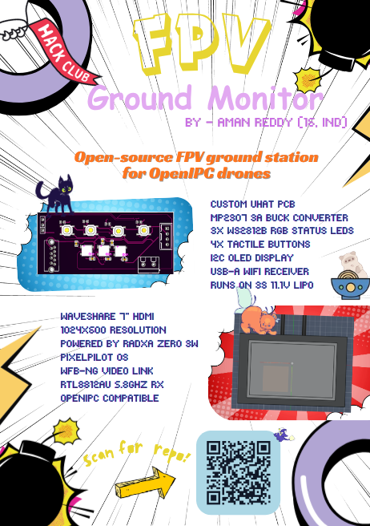

# FPV Ground Monitor 

A custom-built open-source FPV ground station monitor built on the **Radxa Zero 3W** SBC, featuring a custom uHAT PCB for power management, a RTL8812AU WiFi dongle for receiving **OpenIPC** video streams from drones via **WFB-ng**.

Designed to pair with the **MAR Racing Drone** -- a custom 75mm FPV tiny whoop with a fully custom 8-in-1 AIO flight controller (also Hackclub Fallout funded), this monitor closes the loop on a fully open-source, end-to-end FPV video system.

---

## What is it?

A portable, battery-powered FPV video ground station that:

- Receives HD video from an OpenIPC-based drone over 5.8GHz via WFB-ng
- Displays live feed on a 7" HDMI screen via PixelPilot OS on the Radxa Zero 3W
- Powers everything from a 3S 11.1V li-ion battery via a custom uHAT buck converter PCB
- Features 3x WS2812B RGB LEDs for link/recording/battery status
- Has 3 navigation buttons + 1 power button for PixelPilot UI control
- Has an SSD1306 OLED for IP/battery/link status display
- Exposes a UART debug header for development

---

## Why did I make it?

I'm building the MAR Racing Drone -- a fully custom FPV drone with a custom AIO flight controller and an OpenIPC video system (SSC338Q + IMX415). To test and use the video link, I needed a ground station that:

1. Works with OpenIPC/WFB-ng (no DJI goggles)
2. Is portable and battery powered
3. Is fully open source and hackable
4. Is cheap enough to actually build

Commercial alternatives (DJI Goggles, Walksnail) cost $300-600 and lock you into a proprietary ecosystem. This monitor costs under ₹15,000 (~$180) and works with any OpenIPC drone.

---

## How do you use it?

1. Flash PixelPilot OS onto the 64GB microSD card
2. Plug the RTL8812AU dongle into the USB-A port on the uHAT
3. Connect the 3S battery to the XT30 connector on the uHAT
4. Power on via the power button
5. Connect your 7" HDMI display
6. Power on your OpenIPC drone
7. PixelPilot auto-connects via WFB-ng and displays the video feed

---

## Hardware

### BOM

| Component | Part | Source | Qty | Price (INR) |
|---|---|---|---|---|
| SBC | Radxa Zero 3W 2GB | Hubtronics | 1 | ₹6,900 |
| WiFi Module | RTL8812AU USB dongle | Robokits | 1 | ₹975 |
| Display | Waveshare 7" HDMI Capacitive | Robu | 1 | ₹2,500 |
| Battery | 3S 11.1V 2000mAh Li-ion | Robu | 1 | ₹900 |
| MicroSD | SanDisk 64GB A1 | Robu | 1 | ₹550 |
| uHAT PCB | Custom (this repo) | JLCPCB | 1 | ~₹800 |
| Buck Converter | MP2307DN-LF-Z | LCSC C18921 | 1 | - |
| RGB LEDs | WS2812B-V5 | LCSC C691873 | 3 | - |
| Buttons | TS-1187A-B-A-B | LCSC C318884 | 4 | - |
| OLED | SSD1306 128x64 I2C module | AliExpress | 1 | ₹150 |
| 40-pin Header | IDC-SMD_40P-P2.54 | LCSC C9900016611 | 1 | - |
| USB-A Socket | USB3.0VerticalTypeA | LCSC C9900010398 | 1 | - |
| Battery Connector | KF301-2P | LCSC C9900016950 | 1 | - |

Full BOM with LCSC part numbers in `/bom/BOM.csv`

---

## PCB -- uHAT

The custom uHAT PCB sits on top of the Radxa Zero 3W's 40-pin GPIO header and provides:

- **Power**: 11.1V 3S battery → MP2307 buck converter → 5V rail for Zero 3W + display
- **USB**: Routes USB 2.0 from GPIO header pins 27/28 to USB-A socket for WiFi dongle
- **Interface**: 4x tactile buttons, 3x WS2812B RGB LEDs, SSD1306 OLED connector
- **Debug**: UART header (TX/RX/GND) for serial debug access
- **Protection**: Polyfuse on battery input, 100nF decoupling on all power rails

### PCB Specs
- Size: 65 x 30mm
- Layers: 2
- Manufacturer: JLCPCB standard

---
### Firmware
The FPV Ground Monitor runs PixelPilot OS on the Radxa Zero 3W SBC. PixelPilot is an open-source ground station OS built specifically for OpenIPC FPV systems using WFB-ng.
No custom firmware is required -- PixelPilot handles video decoding, display output, and WiFi link management out of the box.

Setup Instructions
1. Flash PixelPilot OS

Download the latest PixelPilot OS image for Radxa Zero 3W from:
https://github.com/OpenIPC/PixelPilot/releases
Flash to a 64GB microSD card using Balena Etcher
Insert microSD into the Radxa Zero 3W

2. Hardware Assembly

Plug the RTL8812AU WiFi dongle into the USB-A port on the uHAT
Connect the 3S 11.1V battery to the XT30 connector on the uHAT
Connect the 7" HDMI display via micro HDMI to HDMI cable
Stack the uHAT onto the Radxa Zero 3W 40-pin GPIO header

3. Power On

Press the power button on the uHAT
PixelPilot OS boots automatically
The RTL8812AU driver is included in PixelPilot OS -- no manual setup needed

4. Connecting to Drone

Power on your OpenIPC drone with WFB-ng configured
PixelPilot automatically scans for WFB-ng streams on 5.8GHz
Video feed appears on the HDMI display within 5-10 seconds

WFB-ng Configuration
For the drone side (MAR Racing Drone AIO FC with SSC338Q + IMX415):

WFB-ng frequency: 5745 MHz (default)
TX power: set in /etc/wfb.conf on the drone
Recommended MCS index: 1 (balance of range and bitrate)
Encoding: H.265 for best quality at low bitrate

For full WFB-ng configuration guide:
https://github.com/svpcom/wfb-ng/wiki

GPIO Button and LED Control (Optional)
The uHAT exposes 4 buttons and 3 WS2812B RGB LEDs via the Radxa Zero 3W GPIO. A Python script can be run on boot to handle these.
Dependencies:
pip install RPi.GPIO rpi-ws281x
Button GPIO pins (BCM numbering):

BTN1: GPIO17 (Pin 11)
BTN2: GPIO27 (Pin 13)
BTN3: GPIO22 (Pin 15)
PWR BTN: GPIO23 (Pin 16)

LED data pin:

GPIO_LED1: GPIO24 (Pin 18) -- WS2812B data in

OLED (SSD1306 I2C):

SDA: GPIO2 (Pin 3)
SCL: GPIO3 (Pin 5)

Sample script for LED status and OLED display coming soon.

References

PixelPilot: https://github.com/OpenIPC/PixelPilot

WFB-ng: https://github.com/svpcom/wfb-ng

OpenIPC: https://openipc.org

Radxa Zero 3W: https://radxa.com/products/zeros/zero3w

---

## Zine Page

---

## Images

---

**Made by Aman | Age 16 | Hyderabad, India**
